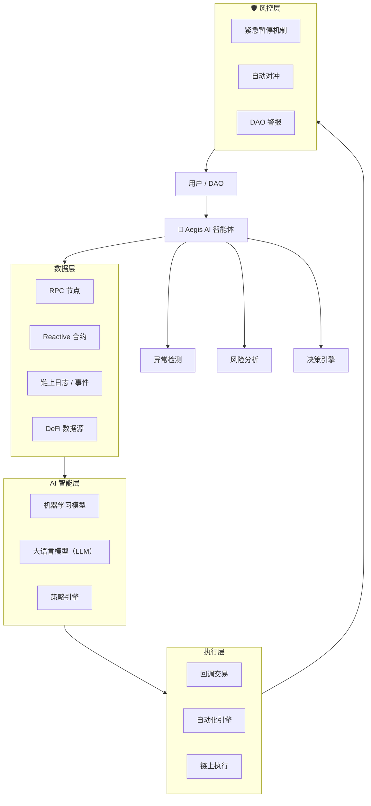

# 🛡 Aegis AI Guardian

### 面向 Web3 的 AI 驱动自治安全系统

---

## 项目简介

**Aegis AI Guardian** 是一个面向 Web3 基础设施（DeFi / DAO / 公链）的 **AI 驱动自治安全系统**。

它通过结合：

* AI（LLM + 机器学习）
* Reactive Contracts（响应式合约）
* 链上自动化执行

将传统“被动执行”的智能合约，升级为：

> **可自我监控、自我决策、自我防御、自我执行的智能系统**

---

## 行业痛点

当前 Web3 系统存在以下核心问题：

* ❌ 智能合约是**被动执行**（必须人为触发）
* ❌ 安全监控依赖链下机器人（不稳定）
* ❌ 风险响应速度慢（无法应对秒级攻击）
* ❌ 闪电贷 / 套利攻击频繁发生

---

## 解决方案

Aegis 提供一个 **AI 自治安全层（Autonomous AI Layer）**：

### 核心能力：

1. 实时监控链上行为（交易 / 事件）
2. AI 风险分析与决策
3. 自动触发链上响应（无需人工）
4. 主动防御攻击（暂停 / 对冲 / 警报）

---

## 系统架构



---

## 核心功能

### AI 异常检测

* 识别异常交易行为
* 检测闪电贷攻击 / 套利行为 / 重入风险

### 响应式自动执行

* 基于事件驱动（无需机器人）
* 自动触发智能合约执行

### 自动化风控

* 自动暂停协议
* 自动对冲风险
* DAO 高优先级告警

### 跨链能力

* 监听 A 链事件 → 在 B 链执行
* 支持跨链自动化工作流

---

## 应用场景示例

### 闪电贷攻击防御

执行流程：

1. 检测到异常流动性变化
2. AI 判断攻击概率
3. 自动执行防御策略：

   * 暂停协议
   * 调整参数
   * 通知 DAO

---

## 技术栈

| 模块    | 技术                    |
| ----- | --------------------- |
| 智能合约  | Solidity              |
| 响应式执行 | Reactive Network      |
| AI    | LLM + 机器学习            |
| 数据层   | RPC / Logs / DeFi API |
| 自动化   | Callback Transaction  |

---

## 工作流程

```text
事件 → 异常检测 → AI分析 → 决策 → 自动执行 → 风险控制
```

---

## 核心创新点

* AI 与智能合约深度融合
* 事件驱动的链上自动化执行
* 自主风控系统（无需人工干预）
* 跨链响应式执行能力

---

## 项目结构

```text
/contracts
  ├── ReactiveContract.sol
  ├── RiskController.sol

/ai
  ├── anomaly_detection.py
  ├── strategy_engine.py

/scripts
  ├── deploy.js
```

---

## Demo

* [ ] 测试网部署
* [ ] 攻击模拟演示
* [ ] 实时监控面板

---

## Roadmap

* [x] 架构设计完成
* [ ] 测试网集成
* [ ] 多链支持
* [ ] DAO 治理模块
* [ ] AI 模型优化

---

## License

MIT License
